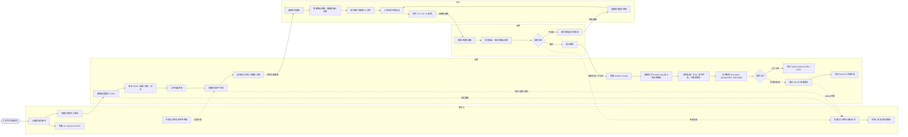
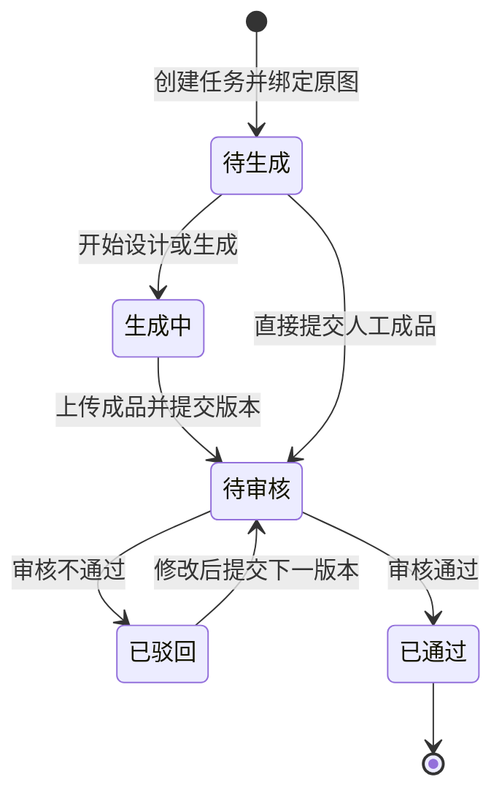
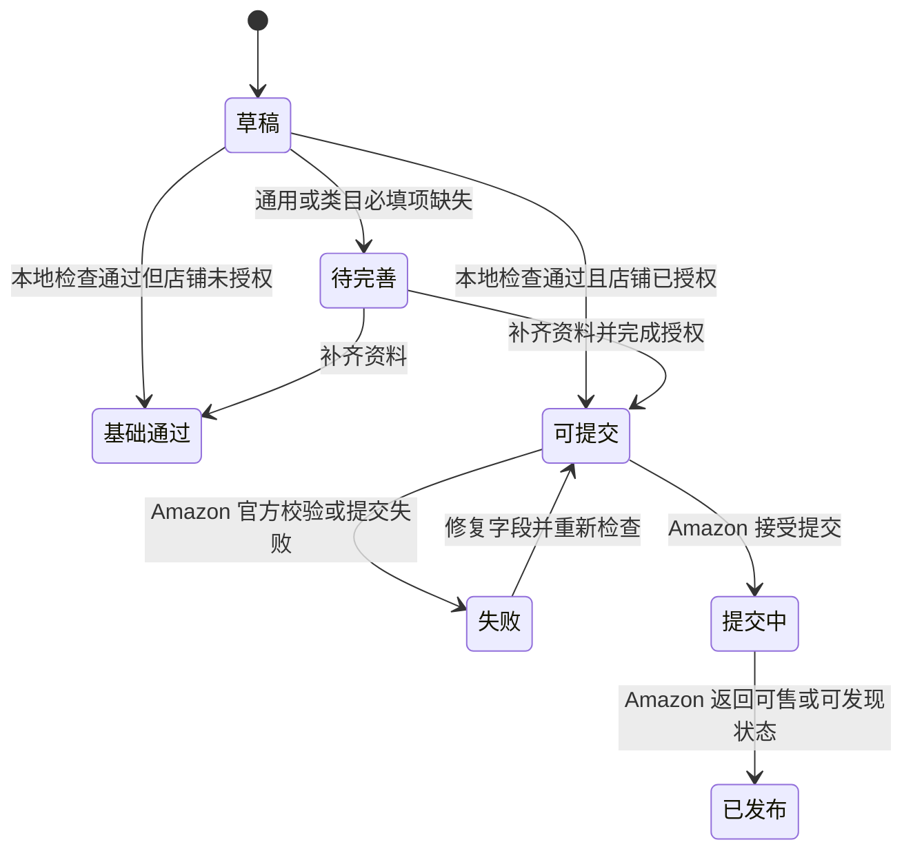
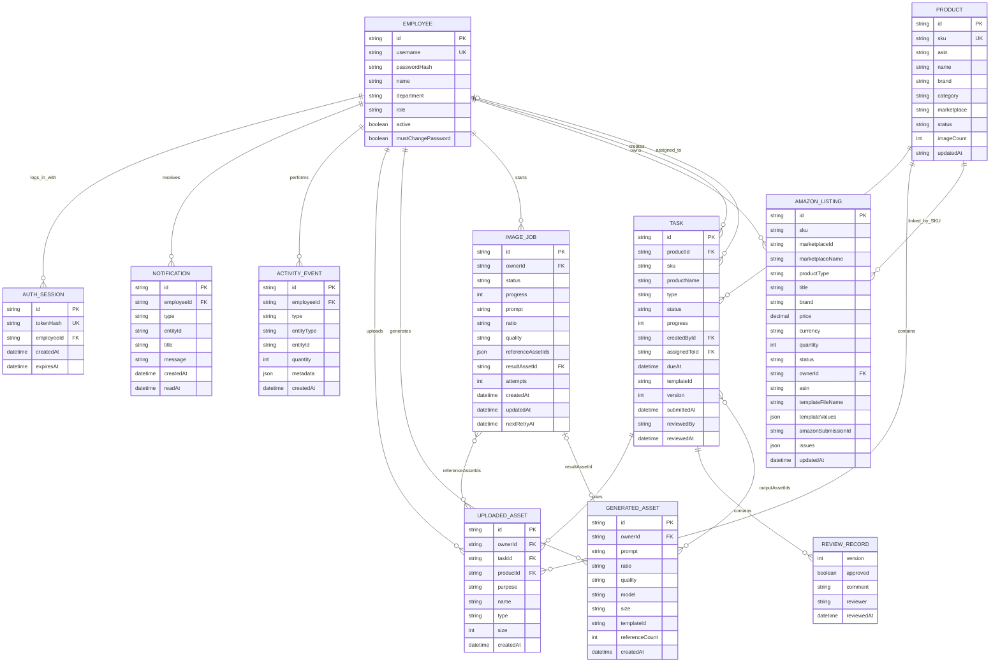
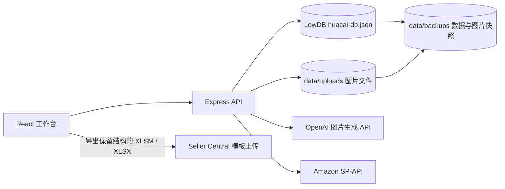

# 花彩系统 ER 图与角色流程

> 基于当前花彩代码与数据结构整理，适用于内部培训、需求评审、后续数据库迁移和 Amazon 上线联调。

## 0. 传统 Chen 实体关系总图

这张图以实际工作流为主线，采用“矩形表示实体、菱形表示关系、椭圆表示属性”的传统 Chen 画法，并标注了 `1 / N / M` 基数。

- [可缩放查看器（推荐）](./花彩系统详细Chen-ER图.html)
- [SVG 矢量原图](./花彩系统详细Chen-ER图.svg)
- [PNG 高清总图](./花彩系统详细Chen-ER图.png)

建议从上方四个角色开始，沿中间主线按 `①—⑧` 阅读：

`运营维护 SKU → 创建并派单 → 设计执行并提交 → 审核版本 → 通过后交付 → 运营完善 Listing → 应用类目模板与 PTD 规则 → 提交 Amazon 店铺`

## 1. 角色业务流程图

## 2. 核心状态流转

### 2.1 视觉任务

约束：

- 只有管理员或设计人员能够提交成品。
- 设计人员只能提交分配给自己的任务。
- 待审核任务不能重复提交；已通过任务不能覆盖。
- 驳回必须填写修改意见，每次提交都会增加版本号。
- 原图必须属于当前商品和任务；上传成品必须标记为 `output`。

### 2.2 Amazon Listing

约束：

- 同一 `SKU + marketplaceId` 只能存在一条 Listing。
- 正式提交前先执行 Amazon `VALIDATION_PREVIEW`。
- 提交中或已发布的 Listing 不能只删除本地记录，必须走 Amazon 下架流程。
- Excel 类目模板字段会转换为 SP-API `attributes`，也可以保留原模板结构导出上传。

## 3. 数据库 ER 图

## 4. 实体关系说明

| 主实体 | 关联实体 | 当前实现 |
|---|---|---|
| 员工 | 会话 | 一个员工可以存在多个有效会话，修改密码后其他设备会退出 |
| 员工 | 任务 | 同时保留创建人和当前负责人 |
| 商品 | 任务 | `TASK.productId` 为真实关联，SKU 和商品名作为历史快照 |
| 商品 | Listing | 当前通过 `SKU` 逻辑关联，没有保存 `productId` 外键 |
| 任务 | 原图/成品图 | `inputAssetIds`、`outputAssetIds` 保存图片 ID；图片元数据同时保存 `taskId` |
| 任务 | 审核记录 | 当前嵌入 `TASK.reviewHistory`，并非独立数据库集合 |
| AI 任务 | 参考图 | `referenceAssetIds` 为多值 ID 数组 |
| AI 任务 | 生成作品 | `resultAssetId` 指向一张生成图片 |
| 通知 | 业务对象 | `entityId` 为多态关联，当前主要指向任务 |
| 操作记录 | 业务对象 | `entityType + entityId` 为多态关联，用于管理员效率统计 |
| Listing | 类目模板 | 保存模板文件名和已填写字段；原始模板文件只在浏览器本地解析 |

## 5. 角色权限矩阵

| 功能 | 管理员 | 运营 | 设计 | 审核 |
|---|:---:|:---:|:---:|:---:|
| 工作台 | ✓ | ✓ | ✓ | ✓ |
| SKU 新建、编辑、批量导入 | ✓ | ✓ | — | — |
| 创建视觉任务 | ✓ | ✓ | ✓（自动分配自己） | — |
| 设置负责人和截止日期 | ✓ | ✓ | — | — |
| 查看任务中心 | ✓ | ✓ | ✓ | ✓ |
| 提交设计成品 | ✓ | — | ✓（仅本人任务） | — |
| 审核通过 / 驳回 | ✓ | — | — | ✓ |
| 素材库与 AI 创作 | ✓ | ✓ | ✓ | ✓ |
| Listing 编辑与模板导出 | ✓ | ✓ | — | — |
| Amazon SP-API 提交 | ✓ | ✓ | — | — |
| 员工效率统计 | ✓ | — | — | — |
| 员工账号与角色管理 | ✓ | — | — | — |
| 数据备份与恢复 | ✓ | — | — | — |
| 修改自己的密码 | ✓ | ✓ | ✓ | ✓ |

## 6. 文件系统与外部服务

这些内容不属于数据库 ER 实体，但属于完整系统：

## 7. 后续数据库升级建议

当前 LowDB 适合单机、小团队内部使用。迁移 PostgreSQL 时建议：

1. 将 `reviewHistory` 拆成独立 `task_reviews` 表。
2. 将任务输入、输出、AI 参考图拆成统一的 `task_assets` 关系表。
3. 给 `amazon_listings` 增加 `product_id`，同时保留 SKU 历史快照。
4. 将 `notification.entityId` 和 `activity.entityId` 改为明确的业务关联或审计事件表。
5. 将图片文件迁移到对象存储，数据库只保存 URL、哈希、尺寸和归属。
6. 为 `SKU`、`username`、`SKU + marketplaceId` 建立数据库唯一约束。
